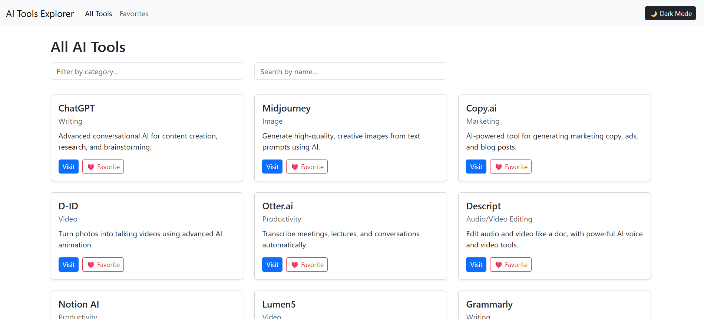
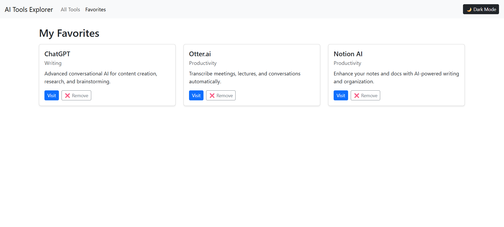
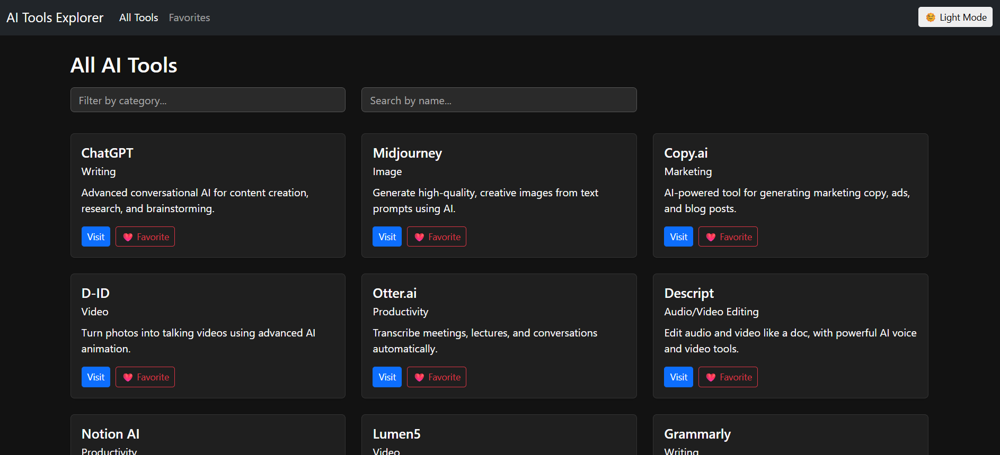
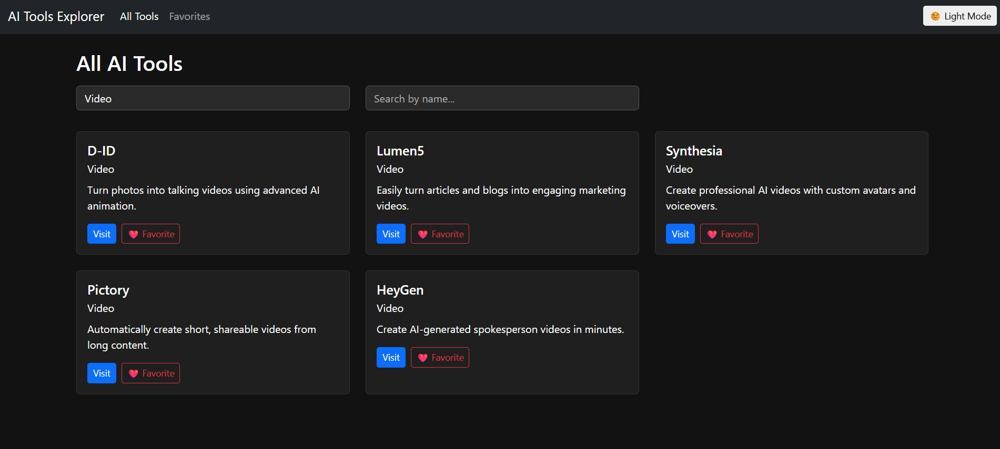
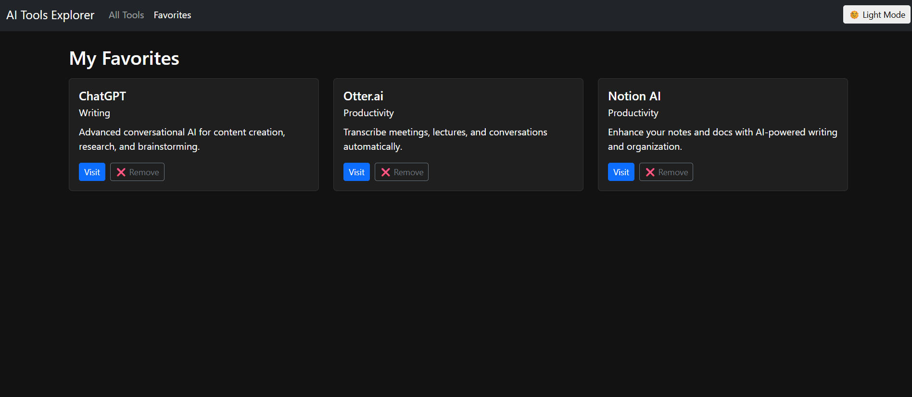

# 🔍 AI Tools Explorer

A full-stack MERN application that allows users to **browse**, **filter**, and **favorite** AI tools across various categories.

---

## 🚀 Features

- 🔎 **Browse all AI tools** as cards
- 📂 **Filter by category or tool name**
- ❤️ **Add to favorites** (with confetti animation 🎉)
- ❌ **Remove from favorites**
- 📊 **Bonus:
- 🎉 **Confetti animation on Save
- 🌗 **Dark mode toggle**
- 📱 **Responsive layout**
- 🔄 **Loading spinners** & error messages

---

## 🛠️ Tech Stack

**Frontend:** React + Bootstrap (via CDN)  
**Backend:** Node.js + Express (CommonJS)  
**API:** In-memory data (no DB required)

---

## 🖼️ Screenshots

| All Tools | Favorites | Dark Mode |
|----------|-----------|-----------|
|  |  |  |  | [By Tool](screenshots/ByToolName.png) | 


---

## 📦 Installation

```bash
# 1. Clone the repo
git clone https://github.com/arpn-Goyal/ai-tools-explorer.git
cd ai-tools-explorer

# 2. Install backend deps
cd server
npm install

# 3. Start backend
npm run start

# 4. In another terminal, run frontend
cd ../client
npm install
npm run dev


📁 Folder Structure
bash
Copy
Edit
/backend
  /controllers
  /routes
  data.js
  server.js

/frontend
  /components
  /pages
  App.jsx
